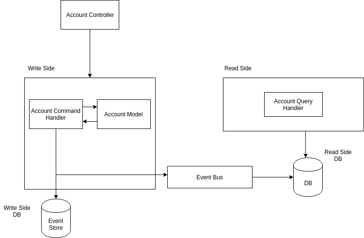
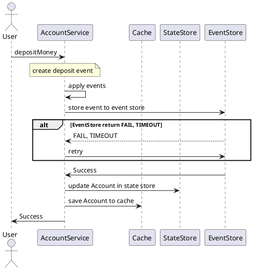
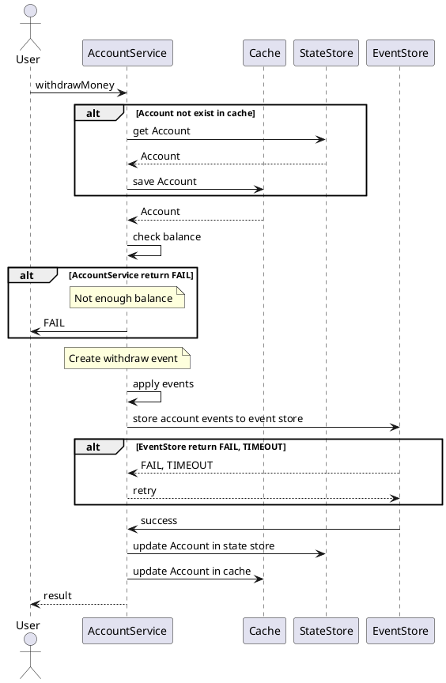
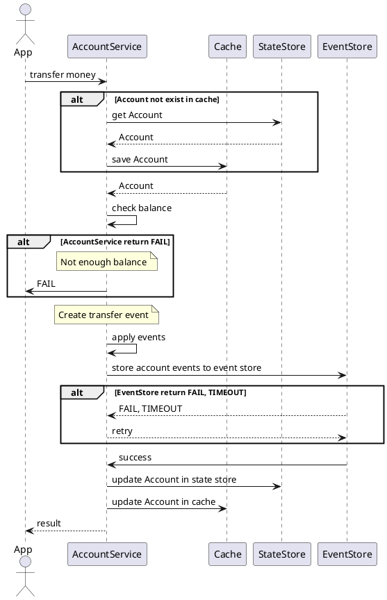

# Event Sourcing

## Theory

- Theo mô hình truyền thống, các entity lưu trong database trong một dòng và nó chỉ trạng thái sau cùng của entity đó.
- Đối với Event sourcing thì khác, nó đảm bảo rằng tất cả các thay đổi của aggregate được lưu trữ dưới dạng một chuỗi các sự kiện. Một aggregate là một nhóm các đối tượng, có thể là các đối tượng hoàn chỉnh. Một aggregate chịu tác động của các event. Event Sourcing hoạt động bằng các lưu trữ các event đó vào event store, đây là nơi chỉ cho phép thêm vào mà không được chỉnh sửa (append only).
- Khi mỗi event của một aggregate sinh ra thì nó sẽ được đánh version, version phản ảnh sự thay đổi chính xác của aggregate theo thời gian, replay lại trạng thái của aggregate đến các mốc thời gian trong quá khứ.
- Ngoài việc lưu trữ các Event thì Event Sourcing còn lưu trữ trạng thái của Aggregate trong một thời điểm nhất định. Việc lưu trạng thái của aggregate này diễn ra như sau: Khi có một event mới, nó sẽ kiểm tra xem số lượng event của aggregate đó đã vượt ngưỡng chưa, nếu vuợt ngưỡng thì nó tiến hành ghi nhận lại trạng thái của aggregate tại thời điểm đó.  Tại sao lại cần lưu trữ trạng thái của aggregate trong khi đã lưu toàn bộ event của nó? Đó gọi là Snapshot, snapshot được sử dụng để tránh trường hợp khi ta cần replay lại các event đã xảy ra với một aggregate nào đó. Việc replay sẽ mất nhiều thời gian và giảm hiệu năng của hệ thống.

- Nếu có một sự kiện phát sinh làm thay đổi trạng thái không mong muốn, vì đặc điểm của event store là append only vì thế ta không thể thay đổi lịch sự thay đổi của trạng thái. Do đó ta có thể tạo thêm một event để đảo ngược trạng thái từ event không mong muốn trước đó, sự kiện này không chỉ giúp ta quay về trạng thái mong muốn mà còn giúp để lại một dấu vết để chỉ ra rằng tại thời điểm đó đã có sự thay đổi.

- Về cơ bản, event sourcing chỉ cần 2 bảng trong database để lưu trữ, bảng đầu tiên là event store. Bảng event store gồm các trường định danh aggregate, các mốc thời giản, sự kiện, dữ liệu và version của aggregate khi có event mới. Bảng thứ 2 là bảng snapshot của aggregate, bảng này bao gồm định danh aggregate, thời gian tạo event, version của aggregate tại thời điểm tạo snapshot, data của aggregate tại thời điểm tạo snapshot.

- Structure:

- event_store table:

| Tên cột          | Kiểu dữ liệu | Chú thích                                   |
|------------------|--------------|---------------------------------------------|
| AggregatedId     | String       | global unique id                            |
| AggregateType    | string       | loại aggregate (danh từ)                    |
| Time             | time         | thời gian tạo event                         |
| Version          | integer      | version của aggreage, tăng khi có event mới |
| Data             | json         | nội dung của event                          |
| UserId           | string       | Id của user tạo event                       |
| hasBeenPublished | boolean      | trạng thái của event đã publish chưa        |

- snapshot table:

| Tên cột      | Kiểu dữ liệu | Chú thích                                       |
|--------------|--------------|-------------------------------------------------|
| AggregatedId | String       | global unique id                                |
| Time         | time         | thời gian tạo event                             |
| Version      | integer      | version của aggregate, tăng khi có event mới    |
| State        | json         | trạng thái của aggregate tại thời điểm snapshot |

## Glossary

- Commands: Có nhiệm vụ validate data, validate xem action được yêu cầu có thể được thực hiện với current state của application hay không và xây dựng Event. Commands trả về một sự kiện để ghi xuống eventstore hoặc một non persisted event, có thể là một quá trình reactor trung gian.
- Events: Được tạo ra bởi các commands và được apply cho Aggregate.
- Aggregates: biểu diễn trạng thái hiện tại của application.
- Calculators: sử dụng để update trạng thái của application. Apply method.

Reactors: sử dụng để trigger khi có sự kiện đặc biệt xảy ra. Được đăng ký bởi hàm On.

Event store: là write model, nơi event được lưu trữ (PostgreSQL).

Query store: là read model, nơi aggregates được lưu trữ (PostgreSQL).

## Mô tả Account Service

- Chuyển tiền vào tài khoản

- Rút tiền

- Chuyển tiền từ ví sang ví

- Account controller: client gọi đến service
- Account Command Handler: Handler các command có thể có của Account. Account Command bao gồm:
  - Create Account
  - Deposit Money
  - Withdraw Money
- Account Model: Gồm các thuộc tính của đối tượng account như accountId, balance và các phương thức để tạo và apply event.
- Account Repository: Truy xuất list event của aggregate, persitent xuống disk và publish event.
- Flow như sau: Account Command Handler xác định loại command, ứng với mỗi command, Handler sẽ gọi phương thức tương ứng bên Account Model, chẳng hạn Deposit Money. Account Model nhận được lời gọi hàm, tuy nhiên nó sẽ không trực tiếp thay đổi state của aggregate, thay vào đó nó tạo một event và gọi ApplyEvent tương ứng với command được gọi. ApplyEvent sẽ tăng version của aggregate và ghi event mới vào list event của aggregate đó. Sau khi Account Model thực hiện xong phần Command, Account Command Handler sẽ gọi phương thức StoreAndPublish, hàm này có nhiệm vụ lưu trữ event được tạo ra trong list event vào event store và apply event tương ứng cho account.
- Sau khi đã persistent event vào event store, AccountRepository tiến hành publish event lên event bus cho các service subscribe topic này.
- Có thể store event ngay trên Kafka thay vì event store, nhưng:
  - Kafka đảm bảo at least once delivery do đó có thể bị duplicates trong event store.
  - Không persist được snapshot, do đó khi replay lại thì rất chậm.
  - Kafka partitions distributed do đó khó quản lý hơn so với database thông thường.

[Source Code](https://gitlab.zalopay.vn/thuyenpt/cqrs-event-sourcing/tree/master/src/EventSourcing)
